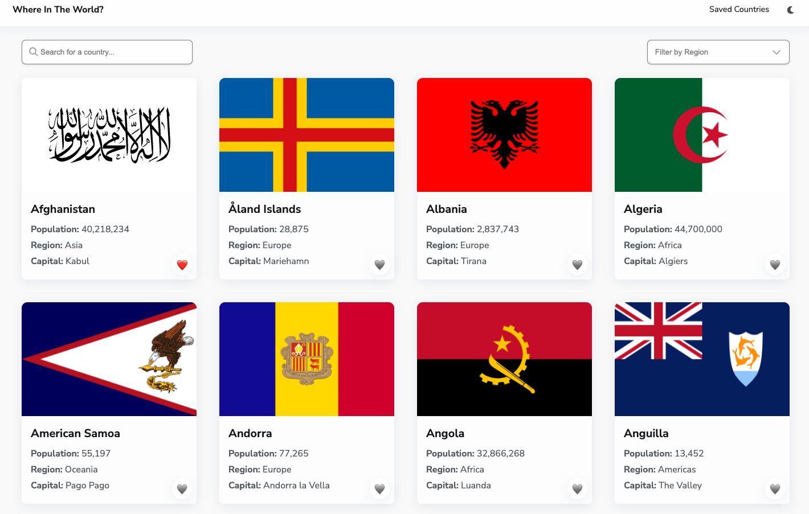
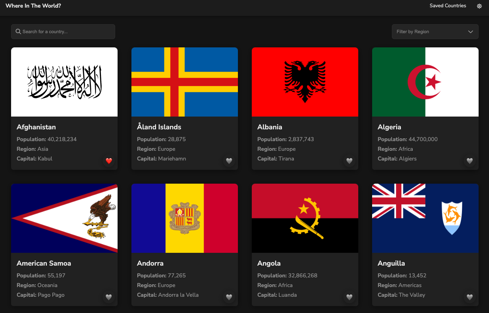
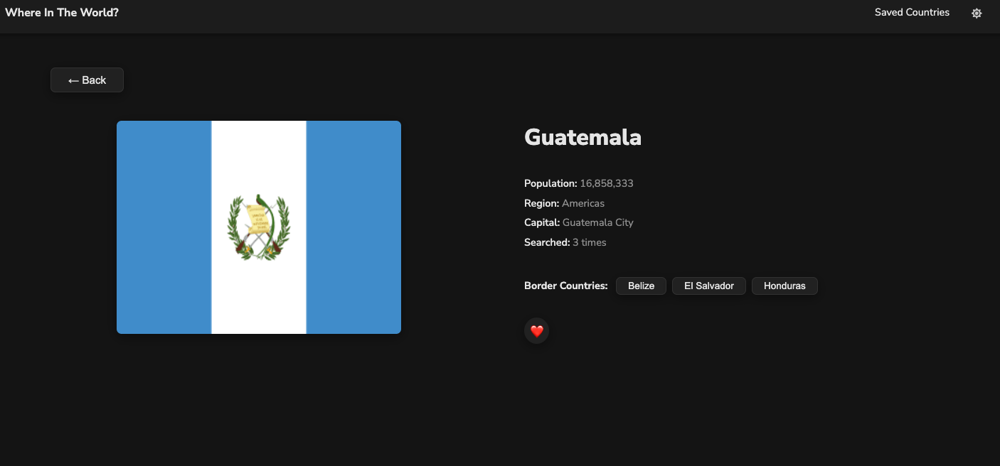
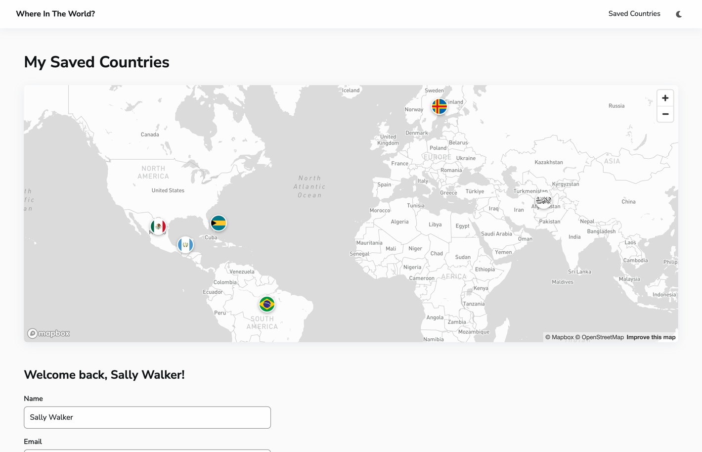
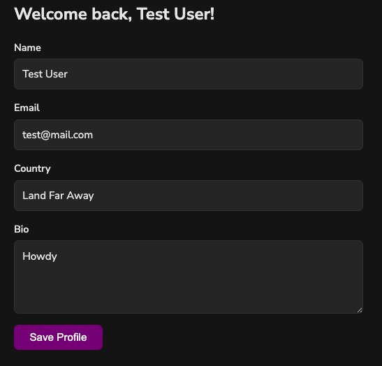

# 📝 Countries App Version 4

## 📌 Project Description & Purpose

A full stack project utilizing React, Neon, Render, Github, Netlify, and human intelligence!

It's a browsable collection of every country in the world. You can search and filter the full list, open any country to see its details and its neighboring countries, heart/save the ones you care about, and fill in a little profile about yourself. The country facts come from a public API, but everything _you_ do - the countries you save, the profile you write, how many times each country page has been opened - is stored in its own PostgreSQL database and served by its own Express API.

This is version 4 of the same app, and each version added one layer:

| Version | What got added                                                                                   |
| ------- | ------------------------------------------------------------------------------------------------ |
| 0–2     | The React frontend: routing, search, filtering, dark mode, the detail page                       |
| 3       | its own Neon (PostgreSQL) database and Express server, running on localhost                      |
| 4       | Deploying all of it - client to Netlify, server to Render - so it's a real, live, full stack app |

The point of version 4 was learning what actually changes when code leaves the laptop: secrets can't live in the repo anymore, the frontend can't talk to `localhost:3005` anymore, and the two halves have to find each other over the internet. And they can!

## 🚀 Live Site

Here's the link to view the live app: [click here](https://countrires-versions.netlify.app/).

The API it talks to lives at [click here](https://countries-app-csgs.onrender.com).

> ⚠️ Worth noting: the server is on Render's free tier, so it goes to sleep when nobody's used it for a while. The first request takes 30–60 seconds to wake it up. If saved countries or the profile look empty on first load, give it a moment and refresh - it's not broken, it's just yawning.

## 🖼️ Screenshots

**Home page** - the full country grid with a search bar and a region filter. Every card is clickable, and the heart in the corner saves it without opening the country (stopPropagation used for that).



**Dark mode** - the toggle lives in the top right and swaps the whole colour scheme. The icon shows what you'd be switching _to_, so a moon when you're in light mode and a sun when you're in dark.



**Country detail page** - population, region, capital, how many times that country's page has been opened, and buttons through to its bordering countries. The "Searched: 3 times" number is coming from its own database.



**Saved Countries** - everything you've hearted, pulled back out of the database and shown as pins on a real Mapbox map. Each pin is that country's flag, and clicking one opens a popup with its capital, a link through to its detail page, and a heart to unsave it, which drops the pin straight away.



**Profile form** - save your name, email, country and bio, and the heading greets you by name when you come back.



## ✨ Features

This is what you can do on the app:

- **Browse every country** in a card grid - flag, population, region and capital on each card, sorted alphabetically
- **Search by name** and **filter by region**, and use both at once to narrow things down
- **Open any country** for a full detail page, and jump to its bordering countries from there
- **See how popular a country is** - every time a detail page opens, the app increases a view counter in its database and shows the new total
- **Save countries** with the heart button, from either the grid or the detail page, and unsave them the same way
- **Revisit your saved countries** on their own page, which survives a refresh because it's stored in the database, not in the browser
- **Fill in a profile** (name, email, country, bio) that loads itself back in and greets you by name next time
- **Switch between light and dark mode**
- **Use it on a phone** - the layout, the header and the card grid all adapt down to small screens

## 🛠️ Tech Stack

**Frontend**

- **Languages:** JavaScript (ES modules), HTML, CSS
- **Framework:** React 19 with React Router 7, built with Vite. Font Awesome for the icons
- **Deployment:** Netlify

**Server/API**

- **Languages:** JavaScript (Node.js, ES modules)
- **Framework:** Express 5, with the `pg` library talking to PostgreSQL
- **Deployment:** Render

**Database**

- **Languages:** SQL (PostgreSQL)
- **Deployment:** Neon

**Where the country data itself comes from:** the [countries.dev](https://countries.dev) API. its database never stores country facts - only country _names_, because the frontend already has the full list loaded and can match the two up.

## 🧭 How The Pieces Fit Together

Every component in the frontend fetches from a relative path like `/api/get-all-saved-countries` - never a full URL. Something in the middle rewrites that into a real address, and it's a different something depending on where you're running:

- **Locally:** the proxy block in [vite.config.js](client/vite.config.js) catches anything starting with `/api`, strips the `/api` off, and forwards it to the Render server
- **Deployed:** [client/public/\_redirects](client/public/_redirects) does the exact same job for Netlify

Doing it this way means no CORS errors, no API URL hardcoded into fifteen components, and the same code works in both places. The `_redirects` file also has a `/* /index.html 200` line - that's what stops a page refresh on `/pages/saved-countries` returning a 404, since Netlify has no such folder and needs to hand every route to React Router instead.

The other thing to notice: the country list is fetched **once**, in [App.jsx](client/src/App.jsx), and passed down to every page as a prop. No page fetches it again. If that fetch fails, the app falls back to a local copy in `localData.js` so it still works offline.

## 🧑‍💻 Getting It Running Locally

You'll need [Node.js](https://nodejs.org) (v18 or newer) and npm.

**1. Clone the repo and go into this version**

```bash
git clone https://github.com/<your-username>/countries.git
cd countries/version-4
```

**2. Start the frontend**

```bash
cd client
npm install
npm run dev
```

That's it - open the URL Vite prints (usually `http://localhost:5173`) and the app works. The `/api` calls are proxied straight to its live Render server, so you get a working database without setting one up.

**3. Add a Mapbox token for the saved countries map**

The Saved Countries page shows your saved countries as pins on a real map, which needs a free Mapbox token.

```bash
cp .env.example .env.local
```

Then open `.env.local`, paste the token after `VITE_MAPBOX_TOKEN=`, and restart the dev server. Vite only reads the file at startup.

**It has to be a public token, the kind that starts with `pk.`** Mapbox also issues secret tokens starting with `sk.`, which carry write access to the account. Vite inlines whatever is in this variable straight into the JavaScript bundle, so a secret token would be readable by anyone who opened devtools on the deployed site.

The map component checks the prefix and will not pass anything other than a `pk.` token to Mapbox, so a secret one shows the unavailable state instead of a working map. That check runs in the browser though, which is after Vite has already inlined the value, so it stops a secret token being used but not from being present in the bundle. The variable must only ever hold a public token.

Public tokens are designed to be visible in frontend code, so the thing that actually protects one is a URL restriction set on the token in the Mapbox account, limiting it to the deployed domain and localhost.

Without a token the rest of the page works exactly as before and the map area shows a short unavailable message. `.env.local` is covered by the `*.local` rule in [client/.gitignore](client/.gitignore), so the token never reaches the repo. On Netlify the same variable goes in the site's build environment, and because Vite bakes it in at build time an existing deploy needs a fresh build to pick it up.

**4. (Optional) Run the server locally too**

Only needed if you want to change the API or point at your own database.

```bash
cd ../server
npm install
DATABASE_URL="your-neon-connection-string" npm start
```

The server reads its connection string from the `DATABASE_URL` environment variable and its port from `PORT`, falling back to `3005`. Nothing is hardcoded, and `config.js` and `.env` are both gitignored - the whole reason for the switch in version 4 was to stop the database password from ever living in the repo. 

If you do run the server locally, point the client at it by changing the proxy `target` in [client/vite.config.js](client/vite.config.js) to `http://localhost:3005`.

## 🔹 API Documentation

These are the API endpoints I built:

1. `GET /get-all-users` - every user row
2. `GET /get-newest-user` - the most recent user, which is what fills the profile form back in
3. `POST /add-one-user` - saves the profile form
4. `GET /get-all-saved-countries` - the names of every hearted country
5. `POST /save-one-country` - hearts a country
6. `POST /unsave-one-country` - unhearts a country
7. `POST /update-one-country-count` - increases a country's view count and returns the new number

Here's the link to the full API documentation: [api-documentation.md](api-documentation.md)

A few decisions worth knowing about if you're reading [server/src/index.js](server/src/index.js):

- **Every route is wrapped in a `handleErrors` function.** They all fail the same way, so rather than writing the same `try/catch` six times, the handler goes inside a wrapper that logs the error and sends back a 500.
- **All queries use `$1`, `$2` placeholders** instead of pasting values into the SQL string. This is what stops someone typing SQL into the profile form and having it actually run.
- **Saving uses `ON CONFLICT DO NOTHING`**, so hearting an already-saved country quietly does nothing instead of erroring.
- **The view counter is an upsert with `RETURNING`** - one round trip both records the visit and hands back the new count, so the detail page doesn't need a second request to display it.
- **The database uses a connection Pool, not a single Client**, so each request gets its own connection, and there's an `error` listener on it because otherwise a dropped idle connection takes the whole server down.

## 🗄️ Database Schema

Here's the SQL I used to create its tables:

```sql
-- the profile form. saving never updates, it always inserts a new row,
-- and the app just reads whichever user_id is highest, so no timestamp column is needed
CREATE TABLE users (
  user_id SERIAL PRIMARY KEY,
  name TEXT,
  country_name TEXT,
  email TEXT,
  bio TEXT
);

-- the heart button. only names go in here, because the frontend already has
-- the full country list to match them against.
-- country_name is UNIQUE so ON CONFLICT DO NOTHING has something to conflict on
CREATE TABLE saved_countries (
  saved_country_id SERIAL PRIMARY KEY,
  country_name TEXT UNIQUE NOT NULL
);

-- how many times each country's detail page has been opened.
-- country_name is the primary key so the upsert can find an existing row to increase
CREATE TABLE country_counts (
  country_name TEXT PRIMARY KEY,
  count INTEGER NOT NULL DEFAULT 0
);
```

## 💭 Reflections

**What I learned:**
This is a little emotional of an answer - because the answer is SO much

#### This project covered 
- Deployment and environments using Netlify, Render, Neon, Github
- Request paths 
- Backend / Express: middleware the app needs
- Database / SQL: creating, connecting, querying, storing, appending and more!
- Third party API
- useEffect, useState, useMemo and more!

In Hailey terms I can now build all three layers and wire them together: a SQL database that stores the data, an Express server that queries and updates it, and a React frontend that talks to that server rather than the database. It all lives in one repo on GitHub, with Neon holding the database, Render running the server and Netlify serving the frontend - and styled so it is functional for the user. A full stack app, end to end, wow.

**What I'm proud of:**
Feeling less of the imposter syndrome when thinking of myself as a Fullstack Developer 

**What challenged me:**
So many new concepts. I'm good at copy / pasting concepts (as in seeing an example and remembering where it should go) but there was a lot of new things to dig into and understand on a deeper level than frontend. Making a grid layout is straight forward but understanding node packages and hooks and setting everything up and really understanding the what and why behind it all took time and will continue to be a learning curve to grasp. This is just the beginning to so much more but the foundation is good.

**Future ideas for how I'd continue building this project:**

1. Adding mapbox API so you could see a real world map that has pins in all your saved countries in the saved countries page - possibly making that a "Oh The Places I've Been" as a spin off of the Dr Suse book "Oh the places you'll go" and it can be your app of places you've traveled with the ability to save notes and pictures from that trip
2. Making this something people could have logins for so they could sync their content across devices and even connect with other people so they could share each others stories of traveling 
3. Adding the ability to save the countries you've been to as well as where you would like to go next and build out for each country a full page of common places to visit when there that a user could save as they plan their trip. 

## 🙌 Credits & Shoutouts

If you used any resources for inspiration, tutorials, or documentation, you can mention them here.
You can also give a shoutout to anyone who helped you along the way.

Shoutout to all of us for getting this far. Seeing my classmates work hard and push through things helped keep me motivated when I was stuck - in it to win it, together. 